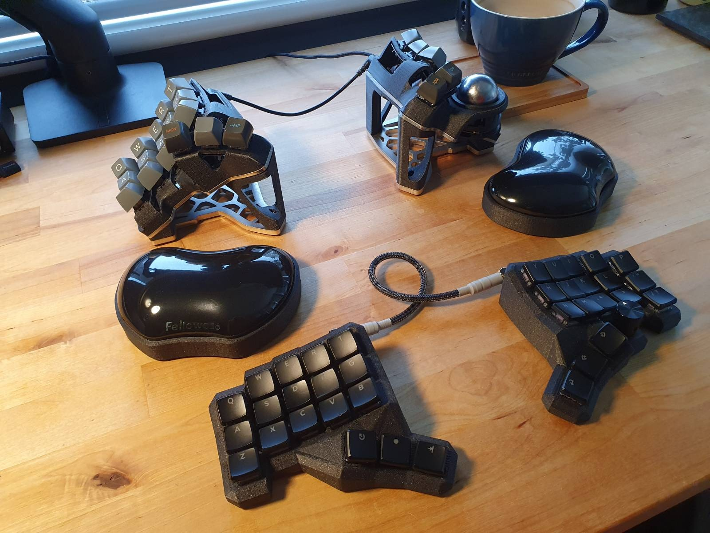

# Summary

This is my personal _userspace_ for [QMK Firmware](https://github.com/qmk/qmk_firmware). It is set up as a self-contained repository that avoids `keymap.c` files within keyboard sub-folders. It can by build by placing this repository within QMK's [userspace](https://docs.qmk.fm/#/feature_userspace) folder and compiling with the JSON files. [Actions](https://docs.github.com/en/actions) can also be leveraged to do likewise on a GitHub container with [build.yml](.github/workflows/build.yml) workflow.

Big thank you to @filterpaper for his work on the original fork of this repo 🙏🏼



# Features

-   Shared [layout](layout.h) wrapper macros
-   [Combos](#combo-helper-macros) simplified with preprocessors
    -   Added Hold only combos for use in application/tab switching code
-   [Achordion](https://getreuer.info/posts/keyboards/achordion/index.html#tap-hold-configuration) support for a better typing experience with Home Row Mods
-   Scrollspam for quick tapping keys with the pointing device. Used for carret movement and media controls.
-   [Word](features/) processing features
    -   Autocorrection for typos
-   No RGB, it's naff.

# BastardKB Charybdis nano

A 3x5_3+2 split ergo keyboard with a trackball. Available from [BastardKB](https://bastardkb.com) pre built or you can self build (I did this).

To build run `qmk compile ./users/pixelbreaker/keymaps/charybdis.json` or to flash directly to the board run `qmk flash ./users/pixelbreaker/keymaps/charybdis.json`

# Sphynx low profile dacman

A keyboard I designed in Clojure based on the infamous Dactyl Manuform. The repo to build the models is [here](https://github.com/pixelbreaker/sphynx-dactyl-keyboard)

To build run `qmk compile ./users/pixelbreaker/keymaps/sphynx.json` or to flash directly to the board run `qmk flash ./users/pixelbreaker/keymaps/sphynx.json`

# Code Snippets

## Combo helper macros

The [QMK combo](https://docs.qmk.fm/#/feature_combo?id=combos) code file `combos.c` is modified from [Jane Bernhardt's helper macros](http://combos.gboards.ca/) to simplify management. Combos are simple one-liners in `combos.inc` and preprocessor macros will generate source codes at compile time.

# Tap Hold Mod Tweaks

These are some custom mod tap settings to avoid false positives with home row mods.

## Tap timer

Setup a tap timer to detect key presses with `process_record_user`:

```c
static fast_timer_t tap_timer = 0;

bool process_record_user(uint16_t const keycode, keyrecord_t *record) {
    if (record->event.pressed) {
        tap_timer = timer_read_fast();
    }
    return true;
}
```

## Increase tapping term while typing

Use the previous tap timer to detect typing interval that are shorter than `TAPPING_TERM * 1.5` with the following macros:

```c
#define TYPING_TERM (TAPPING_TERM * 2)
#define IS_TYPING() (timer_elapsed_fast(tap_timer) < TYPING_TERM)
```

Use `get_tapping_term()` to return higher value on short typing interval to avoid modifier activation:

```c
#define TAPPING_TERM_PER_KEY

uint16_t get_tapping_term(uint16_t keycode, keyrecord_t *record) {
    return IS_QK_MOD_TAP(keycode) && IS_TYPING() ? TYPING_TERM : TAPPING_TERM;
}
```

## Permissive hold for thumb shift

Activate Shift mod tap with another nested key press when not within typing interval.

```c
#define PERMISSIVE_HOLD_PER_KEY

bool get_permissive_hold(uint16_t keycode, keyrecord_t *record) {
    if (IS_QK_MOD_TAP(keycode) && QK_MODS_GET_MODS(keycode) & MOD_MASK_SHIFT && !IS_TYPING()) {
        return true;
    }
    return false;
}
```

## Hold on layer tap

Trigger layer taps immediately with another key press.

```c
#define HOLD_ON_OTHER_KEY_PRESS_PER_KEY

bool get_hold_on_other_key_press(uint16_t keycode, keyrecord_t *record) {
    return IS_QK_LAYER_TAP(keycode) ? true : false;
}
```

# Layout wrapper macros

## Basic setup

A single key map layout can be shared with multiple keyboards using C preprocessors macros. They are referenced in the keyboard JSON files and the build process will expand them into a transient `keymap.c` file during compile time.

The `split_3x5_2` layout is used as the base layout and defined in `layout.h` file, e.g.:

```c
#define _BASE \
	KC_Q,    KC_W,    KC_E,    KC_R,    KC_T,        KC_Y,    KC_U,    KC_I,    KC_O,    KC_P,       \
	KC_A,    KC_S,    KC_D,    KC_F,    KC_G,        KC_H,    KC_J,    KC_K,    KC_L,    KC_QUOT,    \
	KC_Z,    KC_X,    KC_C,    KC_V,    KC_B,        KC_N,    KC_M,    KC_COMM, KC_DOT,  KC_SLSH,    \
	                           SPC_NAV, TAB_SYM,     ENT_FUN, BSP_NUM
```

Next, a wrapper alias to the layout used by the keyboard is also defined in `layout.h` file, e.g. for Cradio:

```c
#define LAYOUT_34key_w(...) LAYOUT_split_3x5_2(__VA_ARGS__)
```

Both macros are referenced in the keyboard's JSON file with the following format:

```c
{
    "keyboard": "cradio",
    "keymap": "filterpaper",
    "layout": "LAYOUT_34key_w",
    "layers": [
        [ "_BASE" ],
        [ "_NUMB" ],
        [ "_SYMB" ],
        [ "_FUNC" ]
    ]
}
```

Append `#include layout.h` to `config.h`. The build process will construct a transient `keymap.c` using the C preprocessor macros referenced by JSON. Wrapper aliases are necessary because `LAYOUT_34key_w(_BASE)` contains a single variable and both macros are replaced (expanded) in the build process concurrently.

## Wrapping home row modifiers

[Home row mods](https://precondition.github.io/home-row-mods) can be wrapped over the layout macros. Order of home row modifiers are defined with these two macros:

```c
#define HRML(k1,k2,k3,k4) LSFT_T(k1),LALT_T(k2),LCTL_T(k3),LGUI_T(k4)
#define HRMR(k1,k2,k3,k4) RGUI_T(k1),RCTL_T(k2),RALT_T(k3),RSFT_T(k4)
```

Both are then placed within the `HRM` macro for the `split_3x5_2` base:

```c
#define HRM(k) HRM_TAPHOLD(k)
#define HRM_TAPHOLD( \
      l01, l02, l03, l04, l05,    r01, r02, r03, r04, r05, \
      l06, l07, l08, l09, l10,    r06, r07, r08, r09, r10, \
      l11, l12, l13, l14, l15,    r11, r12, r13, r14, r15, \
                     l16, l17,    r16, r17                 \
) \
      l01, l02, l03, l04, l05,    r01, r02, r03, r04, r05,       \
HRML(l06, l07, l08, l09), l10,    r06, HRMR(r07, r08, r09, r10), \
      l11, l12, l13, l14, l15,    r11, r12, r13, r14, r15,       \
                     l16, l17,    r16, r17
```

They come together in the JSON file, by wrapping `HRM()` on layers that require them, e.g.:

```c
"layers": [
    [ "HRM(_BASE)" ],
    [ "HRM(_COLE)" ],
    [ "_NUMB" ],
    [ "_SYMB" ],
    [ "_FUNC" ]
],
```

## Adapting layouts

The base layout is shared and adapted for other split keyboards by expanding them with macros. The following example expands Cradio's 34-key to Corne's 42-key 3x6_3 (6-column, 3-thumb) using the following wrapper macro to add additional keys to outer columns:

```c
#define LAYOUT_corne_w(...) LAYOUT_split_3x6_3(__VA_ARGS__)
// 3x5_2 to 42-key conversion
#define C_42(k) CONV_42(k)
#define CONV_42( \
         l01, l02, l03, l04, l05,    r01, r02, r03, r04, r05, \
         l06, l07, l08, l09, l10,    r06, r07, r08, r09, r10, \
         l11, l12, l13, l14, l15,    r11, r12, r13, r14, r15, \
                        l16, l17,    r16, r17                 \
) \
KC_TAB,  l01, l02, l03, l04, l05,    r01, r02, r03, r04, r05, KC_BSPC, \
QK_GESC, l06, l07, l08, l09, l10,    r06, r07, r08, r09, r10, KC_SCLN, \
KC_LSFT, l11, l12, l13, l14, l15,    r11, r12, r13, r14, r15, KC_ENT,  \
         RSA_T(KC_ESC), l16, l17,    r16, r17, RAG_T(KC_DEL)
```

The JSON file for 42-key Corne uses the `C_42()` macro in the following format:

```c
{
    "keyboard": "crkbd/rev1",
    "keymap": "filterpaper",
    "layout": "LAYOUT_corne_w",
    "layers": [
        [ "C_42(HRM(_BASE))" ],
        [ "C_42(_NUMB)" ],
        [ "C_42(_SYMB)" ],
        [ "C_42(_FUNC)" ]
    ]
}
```

# Flashing Notes

## ISP Flashing

## Autocorrect dictionary creation

`qmk generate-autocorrect-data ./users/pixelbreaker/features/dictionaries/dictionary_huge.txt -o ./users/pixelbreaker/features/autocorrect_data.h`
